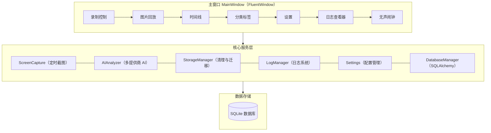
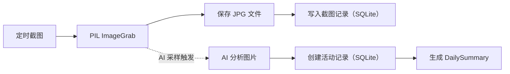

# ScreenLogger

[](https://github.com/ws1336/ScreenLogger) [](LICENSE) []() [](https://github.com/ws1336/ScreenLogger/releases/latest)

> 智能屏幕记录与活动分析工具 — 自动截屏 + AI 分析，让你的时间可视化。

***

## 简介

ScreenLogger 是一款**纯本地运行**的桌面效率追踪工具。它通过定时截屏记录你的工作状态，结合 AI 多模态大模型自动识别活动类型，生成时间线和每日总结，帮助你了解时间都花在了哪里。

> **隐私优先**：所有数据存储在本地，不联网上传任何截图或记录(使用本地Ollama模型情况下)。

***

## 截图预览

| 录制与回放                                                                              | 时间线与总结                                                                              |
|:----------------------------------------------------------------------------------:|:-----------------------------------------------------------------------------------:|
| ![录制与回放][record_pic]  | ![时间线与总结][timeline_pic] |
| **无声闹钟**                                                                           | **设置页**                                                                             |
| ![无声闹钟][alarm_pic] | ![设置页][settings_pic]       |

***

## 功能特性

### 屏幕录制

> 支持定时截屏记录屏幕活动，保护隐私。

- 可配置截图间隔（默认 1 秒），JPG 高质量存储
- 支持暂停/恢复录制，保护敏感信息
- 自动记录当前活动窗口标题（Windows）

### 图片回放

> 支持按时间顺序播放截图，固定 1 帧/秒播放。

- 按时间顺序加载截图，固定 1 帧/秒播放
- 支持跳帧播放（1/2/5/10/30/60/300 张）
- 时间轴滑块显示截图分布密度，支持点击跳转和拖拽定位

### 活动时间线

> 提供列表视图和甘特图视图，方便查看和分析活动时间。

- 双视图切换：**列表视图** + **甘特图视图**
- 甘特图支持 Ctrl+滚轮缩放、Shift+滚轮水平滚动、拖拽平移
- 点击活动块查看/编辑活动详情（类型、描述）
- 支持合并连续相同类型的活动

### AI 智能分析

> 支持 OpenAI Chat Completions 格式、Anthropic Messages 格式、本地 Ollama 模型。
> 注意：使用第三方联网API服务时，数据会上传到服务提供商服务器，本工具不能保证数据隐私安全。注重隐私保护请使用本地Ollama模型。

- **三种 AI 模型接口格式**：
  - OpenAI Chat Completions 格式
  - Anthropic Messages 格式
  - 本地 Ollama 模型
- 录制过程中自动按采样间隔触发后台分析
- AI 识别活动类型并自动创建时间记录

### 分类标签管理

> 提供预设活动标签，支持自定义标签。

- 9 种预设活动标签（编程开发、文档写作、网页浏览等）
- 支持自定义标签，可配置颜色和匹配模式

### 数据管理

> 注重隐私数据存储在本地。

- 自动清理过期数据（默认保留 7 天）
- 支持截图文件 + 数据库整体迁移
- SQLite 本地存储

### 无声闹钟

> 合理规划工作与休息时间，提升工作效率。

- 三种定时模式：单次倒计时 / 每日定时 / 循环定时
- 到期后屏幕四周边框红色脉冲闪烁 + 中央大字提醒
- 全屏透明覆盖层，鼠标事件穿透

### 内置日志查看器

> 提供实时日志查看功能，方便调试和监控应用运行状态。

- 实时显示应用日志，支持按级别和时间范围筛选

***

## 架构概览



### 数据流



***

## 快速开始

### 环境要求

- Python 3.8+
- Windows（推荐，活动窗口标题获取依赖 pywin32）

### 安装与运行

```bash
# 克隆仓库
git clone https://github.com/ws1336/ScreenLogger.git
cd ScreenLogger

# 创建虚拟环境（推荐）
python -m venv venv
.\venv\Scripts\activate

# 安装依赖
pip install -r requirements.txt

# 运行应用
python main.py
```

### 打包为可执行文件

```bash
python build.py
```

输出目录：`dist\ScreenLogger\`，可直接分发运行。

### 初次使用

1. 启动应用，进入「录制控制」页面，点击「开始录制」
2. 录制过程中自动截取屏幕，数据保存在 `~/.cache/ScreenLogger/`
3. 在「设置」页面配置 AI 提供商（可选），开启智能分析
4. 在「活动时间线」页面查看 AI 识别结果

***

## 项目结构

```
ScreenLogger/
├── main.py                  # 应用入口
├── build.py                 # PyInstaller 打包脚本
├── requirements.txt         # Python 依赖清单
│
├── config/                  # 配置管理
│   └── config_manager.py    # 单例配置管理器
├── conf/                    # 配置文件目录
│   ├── settings.ini         # 用户配置（运行中生成）
│   └── settings_default.ini # 默认配置模板
│
├── capture/                 # 屏幕捕获
│   └── screen_capture.py    # 定时截图（QTimer + PIL）
├── database/                # 数据库
│   ├── db_manager.py        # SQLAlchemy CRUD 封装
│   └── models.py            # ORM 模型（5 张表）
├── ai/                      # AI 智能分析
│   └── ai.py                # 多提供商 AI 引擎
├── storage/                 # 存储管理
│   └── storage_manager.py   # 数据清理与迁移
├── logger/                  # 日志系统
│   └── log_manager.py       # 文件日志 + UI 信号
│
├── ui/                      # 用户界面
│   ├── main_window.py       # 主窗口
│   ├── recording_page.py    # 录制控制
│   ├── image_player.py      # 图片播放器
│   ├── timeline_page.py     # 活动时间线
│   ├── gantt_view.py        # 甘特图组件
│   ├── classifier_page.py   # 分类标签管理
│   ├── settings_page.py     # 设置
│   ├── log_viewer_page.py   # 日志查看器
│   ├── alarm_page.py        # 无声闹钟
│   └── silent_alarm.py      # 闹钟覆盖层
│
├── docs/                    # 文档
│   ├── .assets/             # 演示截图
│   ├── CODE_WIKI.md         # 详细技术文档
│   └── alarm_feature_requirements.md
├── assets/                  # 资源文件
│   ├── icon.png
│   └── team_icon.png
├── CONTRIBUTING.md          # 贡献指南
└── LICENSE                  # LGPLv3 开源协议
```

***

## 技术栈

| 模块     | 技术选型                             |
| ------ | -------------------------------- |
| GUI 框架 | PySide6 + PySide6-Fluent-Widgets |
| 屏幕截图   | Pillow (ImageGrab)               |
| 数据库    | SQLite + SQLAlchemy 2.0          |
| AI 集成  | openai / anthropic SDK / Ollama  |
| 配置管理   | QSettings (INI)                  |
| 窗口管理   | pywin32（活动窗口标题）                  |
| 打包工具   | PyInstaller                      |

***

## AI 提供商配置

ScreenLogger 支持三种 AI 分析模式：

| 提供商             | 配置方式               | 特点                   |
| --------------- | ------------------ | -------------------- |
| **OpenAI 兼容**   | API Key + Base URL | 兼容通义千问 VL、DeepSeek 等 |
| **Anthropic**   | API Key            | Claude 系列模型          |
| **Ollama (本地)** | 模型名称 + Base URL    | 完全离线，零成本             |

在「设置 → AI 设置」中配置并测试连接。

***

## 配置说明

配置文件位于 `conf/settings_default.ini`（默认模板），运行后生成 `conf/settings.ini`。

| 配置键                          | 默认值   | 说明              |
| ---------------------------- | ----- | --------------- |
| `screenshot_interval`        | 1     | 截图间隔（秒）         |
| `screenshot_quality`         | 95    | JPG 压缩质量        |
| `image_play_interval`        | 30    | 图片播放跳帧数         |
| `ai_analysis_interval`       | 60    | AI 分析采样间隔（截图张数） |
| `cleanup_days`               | 7     | 数据保留天数          |
| `ai_provider`                | local | AI 提供商          |
| `ai_rate_limit_per_hour`     | 200   | API 频率限制        |
| `ai_analysis_max_image_size` | 1024  | 分析图像最大尺寸        |

***

## 开发计划

### 已实现

- 基础截图录制与回放
- 活动时间线（列表 + 甘特图）
- AI 智能分析（OpenAI / Anthropic / Ollama）
- 分类标签管理（预设 + 自定义）
- 数据清理与迁移
- 内置日志查看器
- 无声闹钟（三种模式）

### 规划中

- 多显示器支持
- 实时分类分析
- 数据加密保护
- 国际化支持
- macOS / Linux 适配

***

## 贡献

欢迎提交 Issue 和 Pull Request！详见 [CONTRIBUTING.md](CONTRIBUTING.md)。

***

## 许可证

本项目采用 [GNU General Public License v3.0](LICENSE) 开源许可证。

***

## 致谢

- [PySide6-Fluent-Widgets](https://github.com/zhiyiYo/PyQt-Fluent-Widgets) - Fluent Design 组件库
- [Ollama](https://ollama.com/) - 本地大模型服务

## 打赏

> 如果您喜欢 ScreenLogger，欢迎打赏支持！
> 您可以在 [GitHub 仓库](https://github.com/ws1336/ScreenLogger) 找到打打赏按钮。
> |            支付宝（Alipay）            |             微信（WeChat）           |
> | :-------------------------------------: | :----------------------------------: |
> |         [![ali_qrcode]][ali_url]        |        [![wx_qrcode]][wx_url]        |

--------------------------------
[record_pic]:/docs/.assets/record.png "录制与回放"
[timeline_pic]:/docs/.assets/timeline.png "时间线与总结"
[settings_pic]:/docs/.assets/settings.png "设置页"
[alarm_pic]:/docs/.assets/alarm.png "无声闹钟"
[ali_qrcode]:/assets/donate_ali.png "支付宝"
[wx_qrcode]:/assets/donate_wx.png "微信"
[ali_url]:https://qr.alipay.com/fkx15490d1pnxvfjodcgb1d "支付宝"
[wx_url]:https://weixin.qq.com/ "微信"
